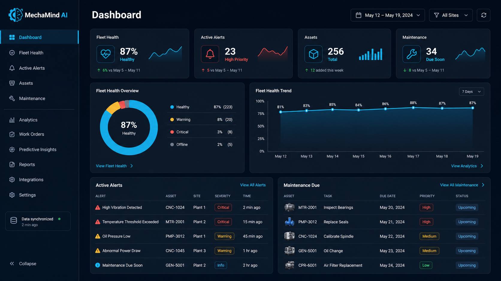
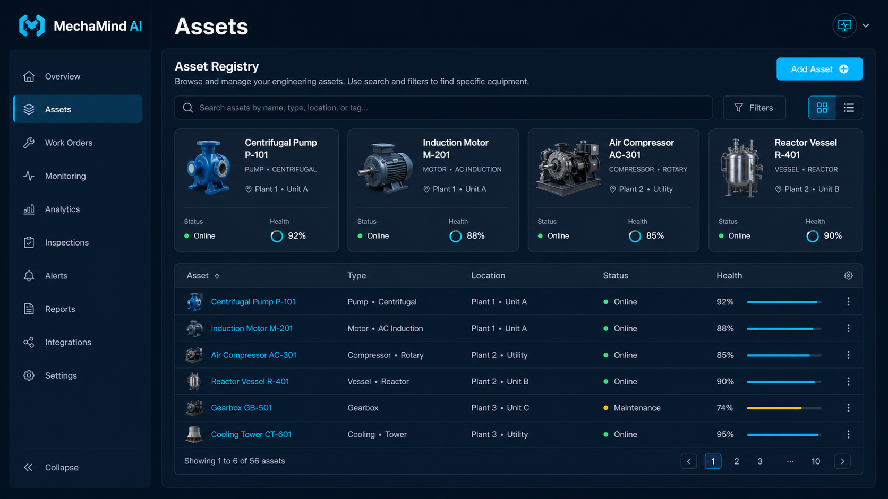
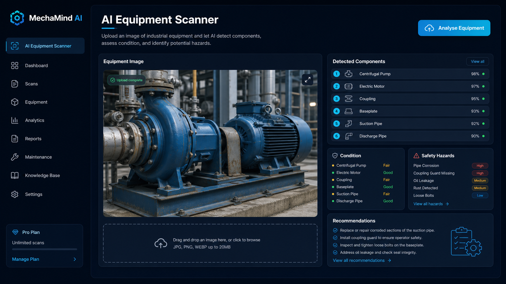
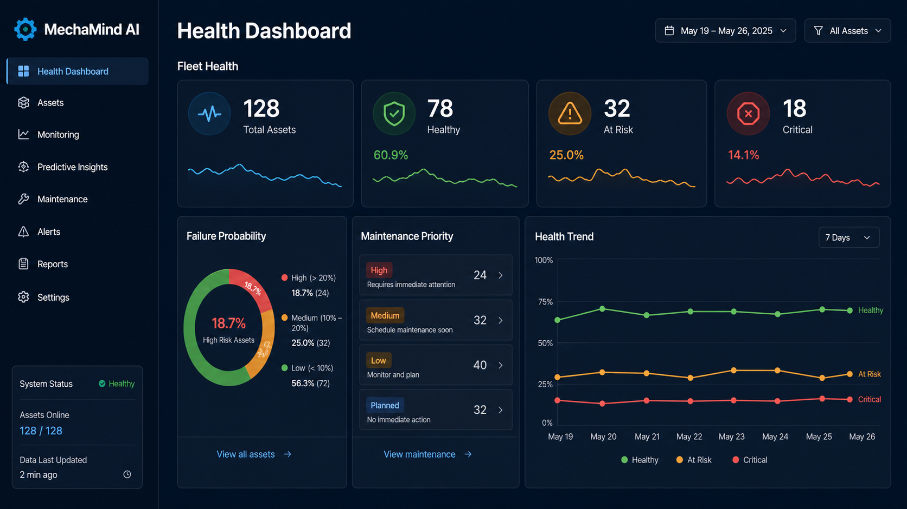
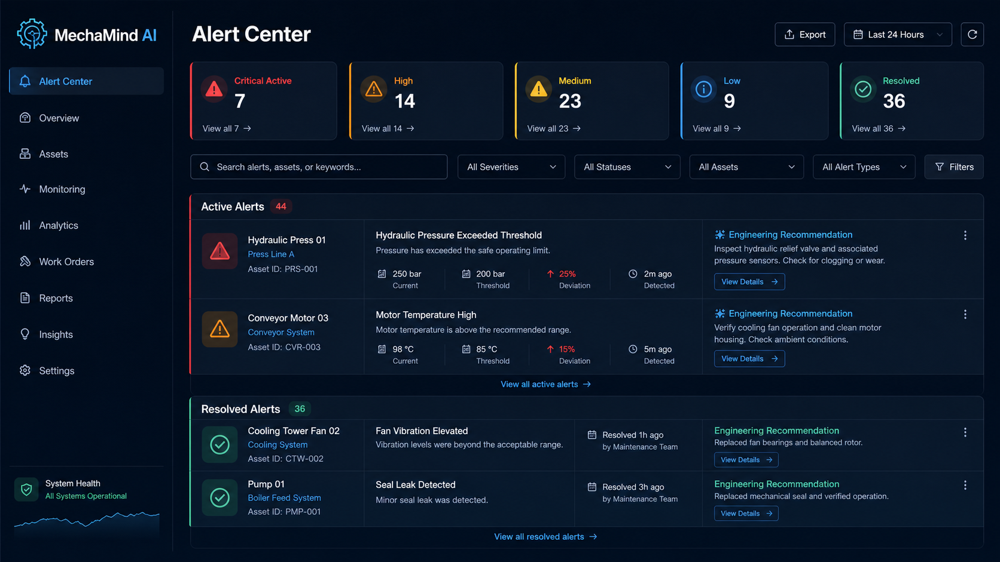
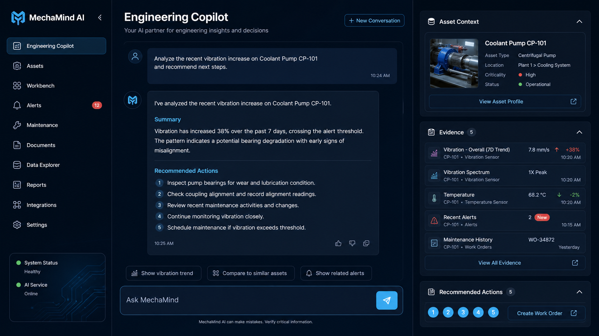
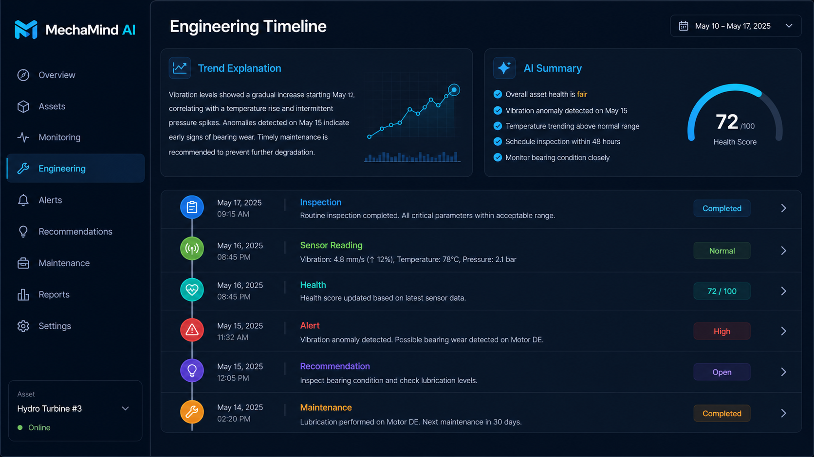
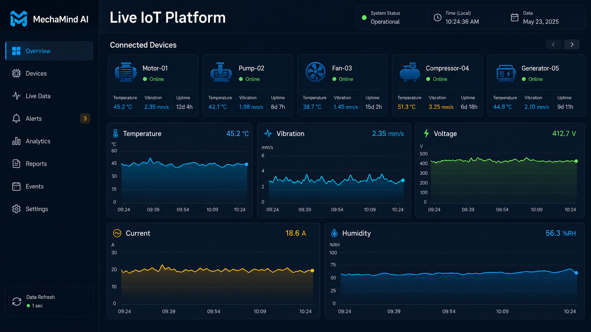
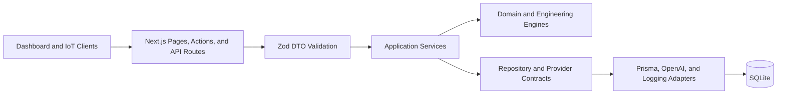

<div align="center">

# MechaMind AI

### AI-powered engineering asset management and predictive maintenance

MechaMind AI unifies asset records, inspections, IoT telemetry, health intelligence, alerts, engineering recommendations, maintenance history, and an AI Copilot in one modern operations platform.

[](./CHANGELOG.md)
[](./LICENSE)
[](#running-tests)
[](#running-tests)

</div>

## Overview

MechaMind AI is an open-source engineering operations platform for reliability teams, maintainers, and asset owners. It combines deterministic engineering rules with optional AI enhancement, providing useful results even when an AI provider is unavailable.

The platform uses clean boundaries: routes validate transport concerns, services orchestrate use cases, engines own engineering decisions, repositories isolate persistence, and provider interfaces contain external integrations.

## Features

- Centralized equipment and asset registry
- AI-assisted equipment image analysis and inspection reports
- Live IoT device management and telemetry ingestion
- Deterministic asset health scoring and failure-risk estimation
- Automatic alert creation, deduplication, acknowledgement, and resolution
- Engineering recommendations with evidence, actions, tools, skills, downtime, and safety guidance
- Unified asset timelines with trend explanations and optional AI summaries
- Context-aware engineering Copilot with conversation history and controlled tools
- Severity-based notification queues and escalation policies
- Responsive operations dashboard with light and dark themes

## Screenshots

| Dashboard | Assets |
| --- | --- |
|  |  |

| AI Scanner | Asset Health |
| --- | --- |
|  |  |

| Alerts | Copilot |
| --- | --- |
|  |  |

| Timeline | IoT |
| --- | --- |
|  |  |

## Architecture Overview



MechaMind AI follows a clean, layered architecture with dependency inversion around repository and provider contracts. Deterministic engines remain authoritative for health, alerts, escalation, and recommendations; optional AI adapters enrich explanations and summaries.

See [Architecture](docs/architecture.md), [Database](docs/database.md), [API](docs/api.md), and [Engineering Guide](docs/engineering.md) for implementation details.

## Technology Stack

| Area | Technology |
| --- | --- |
| Application | Next.js 16 App Router, React 19, TypeScript 5 |
| Styling | Tailwind CSS 4 |
| Database | SQLite, Prisma ORM 7, Better SQLite3 adapter |
| Validation | Zod 4 |
| AI | OpenAI Responses API with deterministic fallbacks |
| Testing | Vitest |
| Quality | ESLint, strict TypeScript, Next.js production builds |

## AI Capabilities

- Structured equipment-image analysis
- Optional alert explanations and recommendation enhancement
- Grounded engineering timeline summaries
- Context-aware Copilot conversations and tool use
- Validated structured output and deterministic fallbacks

AI output supports engineering decisions; it does not replace inspection, diagnosis, or authorization by a qualified professional.

## IoT Platform

Registered sensor devices can submit timestamped temperature, humidity, vibration, voltage, and current readings. Telemetry feeds live monitoring, asset health, automatic alert evaluation, recommendations, and timeline intelligence.

## Predictive Maintenance

The health engine combines inspection condition, AI-report risk, maintenance history, and sensor anomalies to calculate overall, mechanical, electrical, and safety scores. It also estimates failure probability, maintenance priority, trends, and contributing risk drivers.

## Alert Engine

Automatic rules evaluate temperature, vibration, voltage, current, humidity, overall health, and failure probability. Stable asset-and-metric fingerprints prevent duplicate active alerts, while normal readings automatically resolve conditions that are no longer present.

Alerts include severity, lifecycle status, trigger context, related asset data, engineering recommendations, and a complete event timeline.

## Copilot

The Engineering Copilot combines selected asset context, conversation history, health information, alerts, inspections, and controlled tools. Read-only tools execute directly; state-changing operations require explicit confirmation. Generated responses require OpenAI, while core deterministic workflows remain available without it.

## Installation

### Prerequisites

- Node.js 20 or later
- npm
- An OpenAI API key for AI-powered features (optional for deterministic workflows)

```bash
git clone <repository-url>
cd mechamind-ai
npm install
npx prisma generate
npx prisma migrate deploy
```

Optionally seed development data:

```bash
npm run db:seed
```

## Environment Variables

Create `.env.local` in the repository root and do not commit real secrets.

```dotenv
DATABASE_URL="file:./dev.db"

# Optional AI configuration
OPENAI_API_KEY=""
OPENAI_COPILOT_MODEL="gpt-5.6-sol"
OPENAI_ALERT_MODEL="gpt-4.1-mini"
OPENAI_TIMELINE_MODEL="gpt-4.1-mini"

# Recommended for secure Copilot confirmation tokens
COPILOT_CONFIRMATION_SECRET="replace-with-a-long-random-secret"

# Optional Next.js server-action encryption configuration
NEXT_SERVER_ACTIONS_ENCRYPTION_KEY=""
```

`DATABASE_URL` defaults to the local SQLite database. Recommendations, alert explanations, and timeline summaries fall back to deterministic behavior when OpenAI is unavailable. Generated Copilot responses require `OPENAI_API_KEY`.

## Running Locally

```bash
npm run dev
```

Open [http://localhost:3000](http://localhost:3000).

To run the production build locally:

```bash
npm run build
npm start
```

## Running Tests

```bash
npm test
npm run lint
npm run build
```

Use `npm run test:watch` during development.

## Folder Structure

```text
mechamind-ai/
|-- docs/                    # Architecture, API, database, and engineering guides
|   `-- screenshots/         # README screenshot assets
|-- prisma/                  # Schema, migrations, and seed data
|-- public/                  # Static application assets
|-- src/
|   |-- app/                 # App Router pages, API routes, and server actions
|   |-- components/          # Dashboard and domain UI components
|   |-- domain/entities/     # Persistence-independent domain types
|   |-- dto/                 # Validated boundary contracts
|   |-- infrastructure/      # Prisma, HTTP, AI, logging, and provider adapters
|   |-- lib/                 # Shared utilities
|   |-- repositories/        # Repository interfaces
|   `-- services/            # Use-case services and engineering engines
|-- CHANGELOG.md
|-- LICENSE
|-- README.md
`-- ROADMAP.md
```

## Roadmap Summary

Version 1.3 completes the alert domain, automatic evaluation, Alert Center, recommendation engine, timeline intelligence, and notification/escalation engine. Version 1.4 focuses on Field Engineer Mobile, work orders, inventory, authentication, multi-organisation support, and cloud deployment.

See the complete [Roadmap](ROADMAP.md) and [Changelog](CHANGELOG.md).

## Contributing

Contributions, issue reports, and engineering feedback are welcome.

1. Fork the repository and create a focused branch.
2. Keep changes aligned with the documented architecture.
3. Add or update tests for changed behavior.
4. Run `npm test`, `npm run lint`, and `npm run build`.
5. Open a pull request describing the problem, solution, and verification.

For substantial changes, open an issue first to discuss scope and architectural impact. Never commit secrets, local databases, or generated build output.

## License

MechaMind AI is available under the [MIT License](LICENSE).
