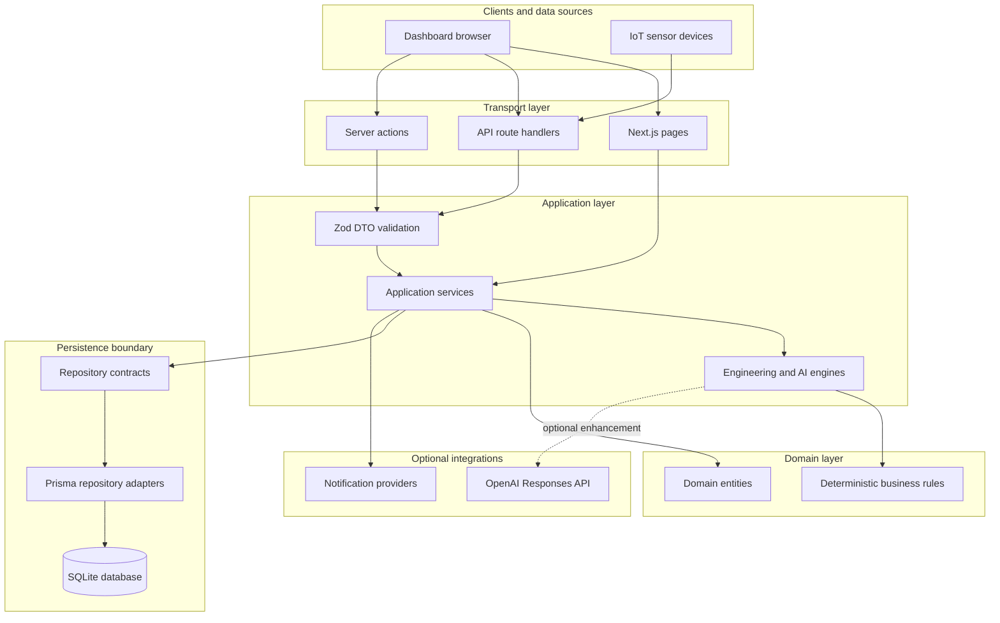
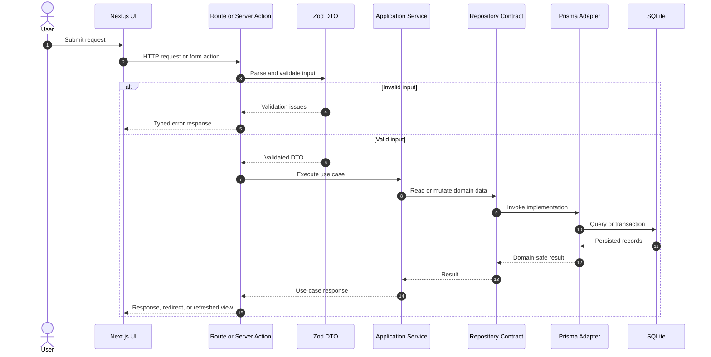
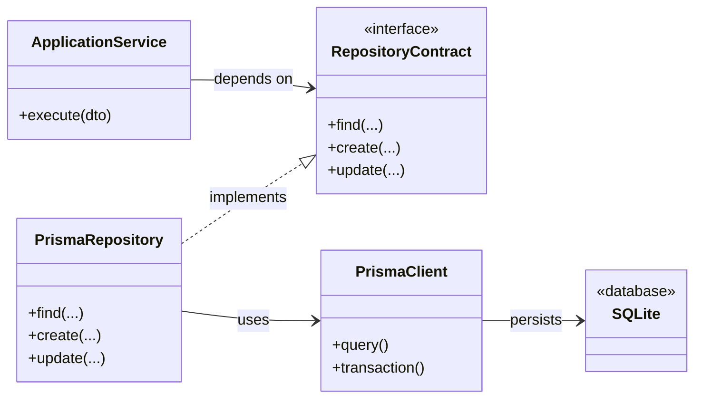
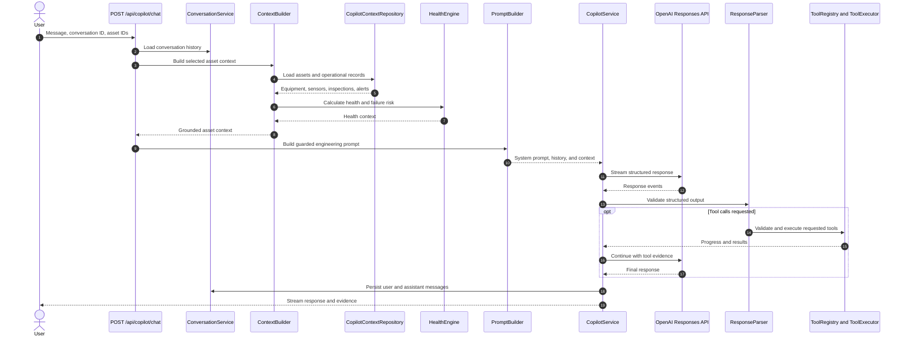
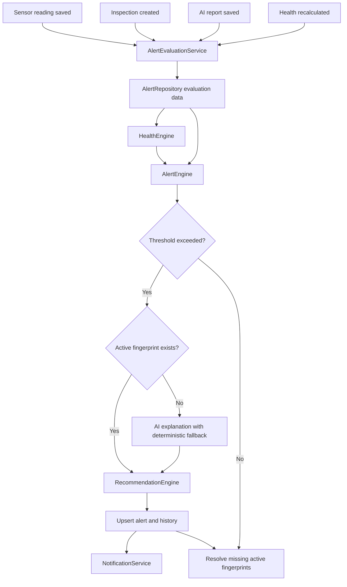
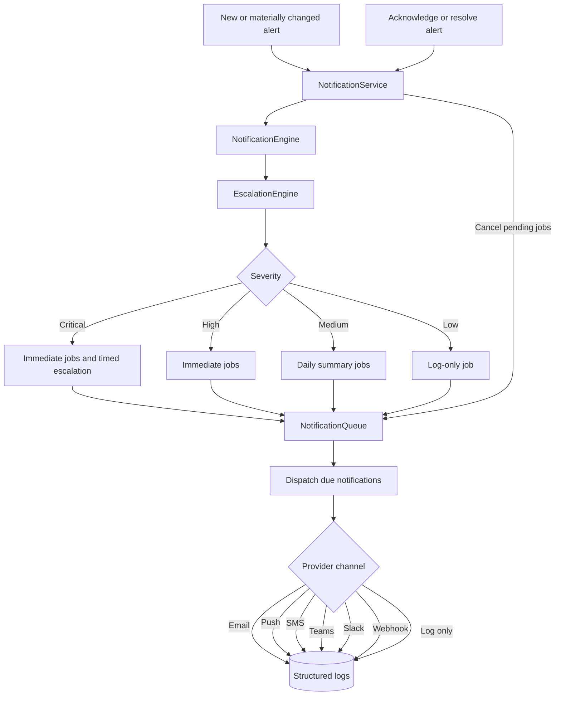

# MechaMind AI Architecture

This document describes the high-level architecture and principal runtime workflows in MechaMind AI. The application follows a layered design that separates transport, validation, orchestration, domain logic, persistence contracts, and infrastructure adapters.

## Overall architecture

### Layer responsibilities

| Layer | Responsibility |
| --- | --- |
| Transport | HTTP handling, form processing, routing, status codes, redirects, and cache revalidation |
| DTO | Validation and type-safe boundary contracts |
| Services | Use-case orchestration and application workflows |
| Domain | Framework-independent entities, state, and deterministic rules |
| Repositories | Persistence interfaces consumed by services |
| Infrastructure | Prisma implementations, database access, logging, and provider adapters |

## Request flow

Routes and server actions remain thin. They validate untrusted input and delegate business behavior to services.

## Repository pattern

Examples include `AlertRepository`, `AssetRepository`, `SensorRepository`, `InspectionRepository`, `CopilotContextRepository`, and `TimelineRepository`. Services depend on these interfaces rather than importing Prisma directly, enabling isolated unit tests and replaceable persistence adapters.

## AI Copilot workflow

Destructive Copilot tools require permission checks and a signed, short-lived confirmation token. Context and conversation text are treated as data rather than executable instructions.

## Alert workflow

The alert engine evaluates temperature, vibration, voltage, current, humidity, overall health, and failure probability. Stable asset-and-metric fingerprints prevent duplicate active alerts. Conditions that return to normal are resolved automatically.

## Notification workflow

All providers are log-only in v1.3. The provider abstraction establishes the integration boundary for future external email, push, SMS, Microsoft Teams, Slack, and webhook adapters. The current queue is process-local and non-durable.

## Design principles

- Deterministic engineering logic remains available when optional AI services fail.
- Services own orchestration; transport code does not contain business rules.
- Persistence and provider integrations remain behind interfaces.
- DTO validation protects every external or serialized boundary.
- Alert, recommendation, timeline, and notification workflows are independently testable.
- AI output augments engineering judgment and does not replace qualified inspection.
