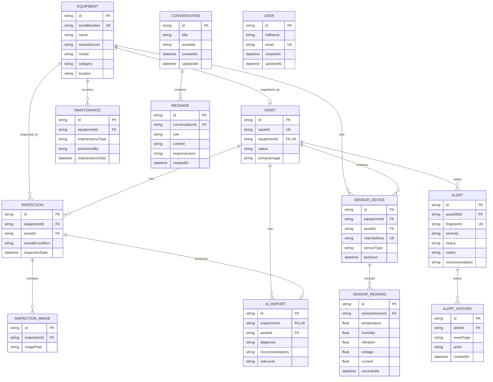
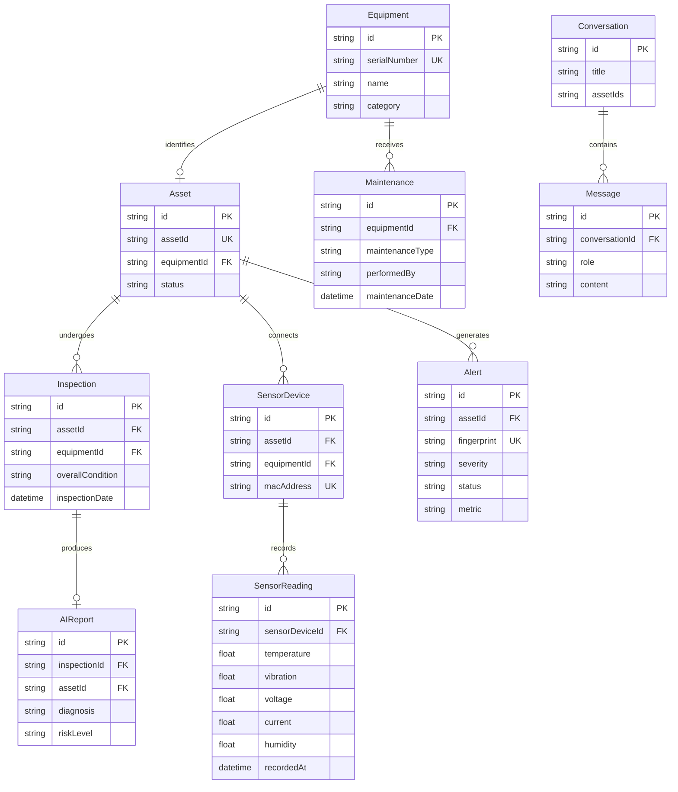

# MechaMind AI Database

MechaMind AI uses [Prisma ORM](https://www.prisma.io/) with SQLite for local persistence. The canonical schema is defined in [`prisma/schema.prisma`](../prisma/schema.prisma), and versioned migrations are stored in [`prisma/migrations`](../prisma/migrations).

## Configuration

The Prisma datasource reads its connection URL from `DATABASE_URL` through `prisma.config.ts`.

```dotenv
DATABASE_URL="file:./dev.db"
```

The generated Prisma client is written to `src/generated/prisma`. Application services do not access Prisma directly; persistence is isolated behind repository contracts and infrastructure adapters.

## Entity relationship diagram



The diagram uses concise conceptual names. In Prisma, `MAINTENANCE`, `CONVERSATION`, and `MESSAGE` correspond to `MaintenanceRecord`, `CopilotConversation`, and `CopilotConversationMessage` respectively.

## Operational asset lifecycle



## Core asset model

### Equipment

`Equipment` stores the physical equipment identity and descriptive information:

- Manufacturer, model, serial number, and category
- Description, location, and representative image
- Inspection, maintenance, and sensor-device relationships

Serial numbers are globally unique.

### Asset

`Asset` is the operational registry entry associated one-to-one with a piece of equipment. It provides:

- A public, unique `assetId`, such as `MM-000001`
- Operational status
- Primary image
- Direct relationships to inspections, AI reports, sensors, and alerts

The database `id` remains an internal relation key. Services and UI routes normally use the public `assetId`.

### AssetSequence

`AssetSequence` supports deterministic allocation of public asset identifiers. Sequence changes should be performed transactionally to avoid duplicate identifiers.

## Inspection and maintenance data

### Inspection

An inspection belongs to both an asset and its equipment record. It stores the observed overall condition, notes, inspection date, attached images, and an optional AI report.

### InspectionImage

Inspection images store a path to the uploaded file. Deleting an inspection cascades to its image records.

### AIReport

Each inspection can have at most one AI report. Reports contain:

- Diagnosis
- Recommendations
- Risk level
- Creation time

The report also references the asset directly for efficient asset-level reporting.

### MaintenanceRecord

Maintenance records belong to equipment and capture the maintenance type, responsible person, notes, and completion date. They contribute to health scoring, recommendations, and the engineering timeline.

## IoT telemetry

### SensorDevice

A sensor device belongs to both an asset and its equipment record. Its MAC address is unique and can be used to associate incoming readings with the correct asset.

### SensorReading

Sensor readings contain optional measurements for:

- Temperature
- Humidity
- Vibration
- Voltage
- Current

Measurements are optional so a device can submit only the metrics it supports. `recordedAt` is used for chronological analysis and timeline aggregation.

## Alerts and recommendations

### Alert

Alerts belong to an asset and contain:

- Severity, category, status, source, and monitored metric
- Human-readable title and explanation
- Observed and threshold values
- Trigger identity
- A structured engineering recommendation serialized into the `recommendation` text field
- Acknowledgement and resolution metadata

The Prisma field `assetId` maps to the physical database column `assetDbId`. It contains the internal `Asset.id`, not the public asset identifier.

The unique `fingerprint` provides idempotency for automatic evaluation. A stable asset-and-metric fingerprint prevents duplicate active alerts and allows resolved conditions to reopen the existing alert record.

### AlertHistory

Alert history is an append-only lifecycle trail containing created, acknowledged, resolved, reopened, and severity-change events. Each record can include previous and next values, an actor, and an explanatory note.

## Copilot conversations

`CopilotConversation` stores a conversation title and selected asset identifiers. The `assetIds` field is serialized JSON rather than a relational join table.

`CopilotConversationMessage` stores ordered user and assistant messages. `responseJson` optionally preserves structured assistant output alongside the display content.

## Indexes and constraints

Important constraints include:

- Unique user email
- Unique equipment serial number
- One asset per equipment record
- Unique public asset identifier
- Unique sensor MAC address
- One AI report per inspection
- Unique alert fingerprint

Alert query indexes support:

```text
(status, severity, updatedAt)
(assetId, updatedAt)
(category, source, createdAt)
```

Lifecycle and conversation indexes support chronological retrieval:

```text
AlertHistory(alertId, createdAt)
CopilotConversationMessage(conversationId, createdAt)
```

## Cascade behavior

Most dependent operational records use `onDelete: Cascade`:

- Deleting equipment deletes its asset, inspections, maintenance records, and sensor devices.
- Deleting an asset deletes its direct inspections, reports, sensors, and alerts.
- Deleting an inspection deletes images and its AI report.
- Deleting a sensor device deletes readings.
- Deleting an alert deletes lifecycle history.
- Deleting a Copilot conversation deletes its messages.

Destructive operations should therefore be explicitly authorized and carefully scoped.

## Migrations

The migration history currently covers:

1. Core equipment, inspection, maintenance, and telemetry models
2. Asset registry
3. Sensor-to-asset relationships
4. Copilot conversations
5. Alert engine persistence
6. Enriched alert context
7. Alert domain foundation and indexes

Apply committed migrations:

```bash
npx prisma migrate deploy
```

Create a migration during development:

```bash
npx prisma migrate dev --name describe_your_change
```

Regenerate the Prisma client after schema changes:

```bash
npx prisma generate
```

## Development operations

Seed the local database:

```bash
npm run db:seed
```

Inspect data using Prisma Studio:

```bash
npx prisma studio
```

Validate and format the schema:

```bash
npx prisma validate
npx prisma format
```

## Persistence boundaries

Application services consume repository interfaces from `src/repositories`. Prisma implementations live in `src/infrastructure/repositories`. This keeps persistence details out of service and domain logic and makes service tests independent from SQLite.

The notification queue and derived health history are not persisted in v1.3:

- Notification jobs are process-local and non-durable.
- Health history is calculated from inspections, maintenance, and sensor readings.
- Structured recommendations are stored as serialized JSON in the alert recommendation field.

Future production deployments may replace SQLite and the in-memory queue while preserving the repository and provider contracts.
