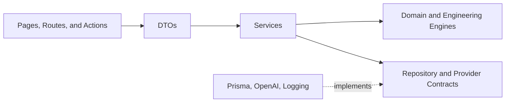
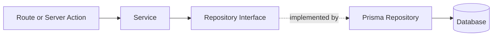
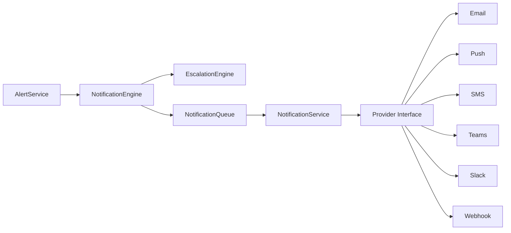

# MechaMind AI Engineering Guide

This guide describes the engineering conventions used by MechaMind AI. It is intended for contributors extending the platform while preserving its layered architecture, deterministic engineering logic, and testability.

## Clean Architecture

MechaMind AI applies clean-architecture principles to keep business rules independent from frameworks and infrastructure. Dependencies point inward toward stable contracts and deterministic domain behavior.



The main dependency rules are:

- Transport code may call services but must not implement engineering rules.
- Services may depend on repository and provider interfaces, not concrete infrastructure adapters.
- Engines are deterministic, stateless where practical, and unaware of Next.js or Prisma.
- Infrastructure implements contracts and contains persistence or provider-specific details.
- DTOs protect boundaries without becoming persistence entities.

## Coding Standards

### TypeScript

- Keep TypeScript strict and avoid `any`. Model uncertain values as `unknown` and narrow them explicitly.
- Prefer named exports, type-only imports, and the `@/` path alias for application modules.
- Give domain concepts explicit names. Use suffixes such as `Dto`, `Service`, `Engine`, `Repository`, and `Provider` consistently.
- Keep functions focused and make side effects visible. Pure calculations belong in engines or domain utilities; persistence and external interactions belong in services or infrastructure adapters.
- Use constructor injection for dependencies so services can be tested without databases or external systems.
- Treat dates as `Date` values internally and serialize them only at transport boundaries.
- Do not expose Prisma records directly through API or UI boundaries. Map persistence models to domain entities or DTOs.

### Error handling and logging

- Validate untrusted input before invoking business logic.
- Throw meaningful errors at the layer that has enough context to explain the failure.
- Log operational events with stable identifiers such as `assetId`, `alertId`, and evaluation source.
- Never log secrets, credentials, raw authorization headers, or unnecessary personal data.
- A failed optional integration must not replace a valid deterministic result. For example, recommendation generation falls back to engineering rules when AI enhancement is unavailable.

### File and test conventions

- Keep transport code in `src/app`, DTOs in `src/dto`, orchestration in `src/services`, repository contracts in `src/repositories`, and concrete adapters in `src/infrastructure`.
- Place unit tests close to the behavior they verify using `*.test.ts` or the established test layout.
- Test observable behavior rather than private implementation details.
- Before submitting a change, run:

```bash
npm test
npm run lint
npm run build
```

## DTOs

Data Transfer Objects define the supported shape of data crossing a boundary. MechaMind AI uses Zod schemas as the executable source of truth and infers TypeScript types from those schemas.

```ts
import { z } from "zod";

export const ExampleDtoSchema = z.object({
  assetId: z.string().min(1),
  value: z.number().finite(),
});

export type ExampleDto = z.infer<typeof ExampleDtoSchema>;
```

DTO rules:

- Parse request bodies, query parameters, provider payloads, and AI output at their entry boundary.
- Keep create, update, query, action, and response DTOs separate when their contracts differ.
- Use enums for closed sets such as alert severity, status, category, source, and notification channel.
- Keep DTOs serializable and free of repository or framework behavior.
- Add defaults only when the product behavior is unambiguous.
- Update DTO tests whenever a public contract changes.

## Repository Pattern

Repositories isolate persistence from business logic. Services depend on repository interfaces, while infrastructure modules implement those interfaces with Prisma or another storage mechanism.



A repository should:

- Express operations in domain language rather than leaking ORM query details.
- Return domain entities or documented persistence results.
- Own database filtering, ordering, pagination, and transactional writes.
- Keep atomic invariants atomic. Duplicate alert prevention, for example, must remain safe when evaluations overlap.
- Avoid embedding orchestration, notification, AI, or presentation logic.

When adding a repository operation, update the interface first, implement it in the infrastructure adapter, and supply an in-memory or mocked implementation in unit tests.

## Services

Services coordinate use cases across repositories, engines, providers, and other services. They are the primary location for application workflow.

A service may:

- Load the data required for a use case.
- Validate authorization and application-level preconditions.
- Invoke one or more deterministic engines.
- Persist the resulting state through repositories.
- Trigger secondary workflows such as recommendations or notifications.
- Return a DTO suitable for the calling boundary.

A service should not contain framework-specific rendering logic or duplicate formulas owned by an engine. Dependencies should be injected, and optional dependencies should have explicit fallback behavior. Side effects should occur in a predictable order and be tested for both success and failure paths.

## Health Engine

The Health Engine calculates an asset health snapshot from inspections, maintenance records, and sensor readings. It is deterministic and stateless: identical normalized inputs must produce the same output.

The health result includes the overall score, mechanical, electrical, and safety scores, failure probability, maintenance priority, trends, and contributing drivers. `HealthService` is responsible for loading inputs, invoking the engine, storing health history, and initiating downstream alert evaluation.

When changing health logic:

- Keep scoring rules centralized in the engine or its domain calculator.
- Clamp scores and probabilities to their documented ranges.
- Explain score changes through drivers or trends rather than returning an unexplained number.
- Preserve safe behavior when input history is incomplete.
- Add boundary, regression, and mixed-signal tests.
- Review the effect on alert thresholds, timelines, recommendations, and Copilot responses.

## Alert Engine

The Alert Engine evaluates normalized engineering signals for:

- Temperature
- Vibration
- Voltage
- Current
- Humidity
- Overall health
- Failure probability

Each rule determines whether a condition is normal or exceeded and, when exceeded, produces a finding with a category, severity, trigger source, evidence, and stable fingerprint. The fingerprint identifies one alert type for one asset and supports duplicate prevention.

`AlertEvaluationService` orchestrates the complete workflow:

1. Load the latest asset signals and health data.
2. Run deterministic alert rules.
3. Upsert newly triggered or continuing findings.
4. Resolve active alerts whose conditions have returned to normal.
5. Generate or refresh recommendations where required.
6. Trigger the notification workflow for relevant alert events.
7. Log the evaluation and its outcome.

Alert rules must remain deterministic, unit-aware, and explicit at threshold boundaries. Tests should cover values below, at, and above every threshold, as well as duplicate active alerts and automatic resolution. Do not place threshold comparisons in route handlers or UI components.

## Notification Engine

The notification subsystem separates policy, scheduling, delivery, and persistence concerns:



The escalation policy is severity-driven:

| Severity | Behavior |
| --- | --- |
| Critical | Notify immediately and schedule escalation after the configured timeout |
| High | Notify immediately |
| Medium | Include in the daily summary |
| Low | Log only |

`NotificationEngine` converts alert events into notification and escalation DTOs. `EscalationEngine` selects timing and channels. `NotificationQueue` holds scheduled work, and `NotificationService` dispatches due items through the provider abstraction. Acknowledging or resolving an alert must cancel work that is no longer applicable.

The current email, push, SMS, Teams, Slack, and webhook providers are intentionally log-only. External delivery should be added behind the existing provider interface, with validated configuration, retry and idempotency behavior, delivery status tracking, and provider-specific tests. Secrets must remain in environment variables and must never enter DTOs or logs.

## Timeline Engine

`TimelineService` builds a chronological engineering view of an asset from inspections, sensor readings, calculated health history, alerts, recommendations, and maintenance events. It maps heterogeneous records into a common timeline DTO before ordering and summarizing them.

Trend explanations are deterministic and grounded in recorded changes. An optional AI adapter may provide a concise summary, but it receives bounded timeline evidence and must fall back to the deterministic explanation when configuration, validation, or the provider fails.

Timeline changes should preserve stable event identifiers, source attribution, chronological ordering, and graceful handling of missing event categories. Aggregation queries belong in repository contracts; presentation grouping belongs at the UI boundary.

## Copilot

The Copilot workflow separates context, prompting, model communication, tool selection, execution, confirmation, and conversation persistence. `ContextBuilder` loads only relevant asset evidence, while the prompt layer establishes engineering and safety constraints.

Tools are registered through explicit definitions and executed through `ToolExecutor`. Read-only tools can run directly. State-changing tools require a short-lived confirmation token and must validate authorization again at execution time. Conversation messages and structured responses are persisted through the conversation repository.

Copilot output must cite available evidence, distinguish observation from inference, avoid inventing measurements, and clearly surface uncertainty. New tools require DTO validation, permission classification, bounded output, and success, rejection, confirmation, and failure tests.

## Engineering Rule Engine

`EngineeringRuleEngine` converts an alert finding into a structured deterministic recommendation containing:

- Root cause and confidence
- Priority and evidence
- Recommended actions
- Required tools and skills
- Estimated downtime
- Safety warnings
- Follow-up inspection guidance

Rules cover temperature, vibration, voltage, current, humidity, health score, and failure probability. Recommendations must remain useful without OpenAI and must never weaken safety guidance when optional AI enhancement is applied.

When adding a rule, define the supported metric and category explicitly, use measured evidence, keep units consistent, document threshold assumptions, and add tests for normal, boundary, and exceeded conditions. Generic fallback recommendations should remain conservative and actionable when a specialized rule does not apply.

## Engineering Change Checklist

- Preserve the dependency direction: transport to service to repository contract to infrastructure.
- Use a DTO for every new boundary and validate untrusted input.
- Keep calculation rules deterministic and isolated in an engine.
- Add tests for normal behavior, boundaries, failures, and idempotency.
- Consider downstream effects on alerts, health, recommendations, timelines, notifications, and Copilot.
- Update architecture, API, database, roadmap, or engineering documentation when a contract changes.
- Verify tests, linting, and the production build before merging.
